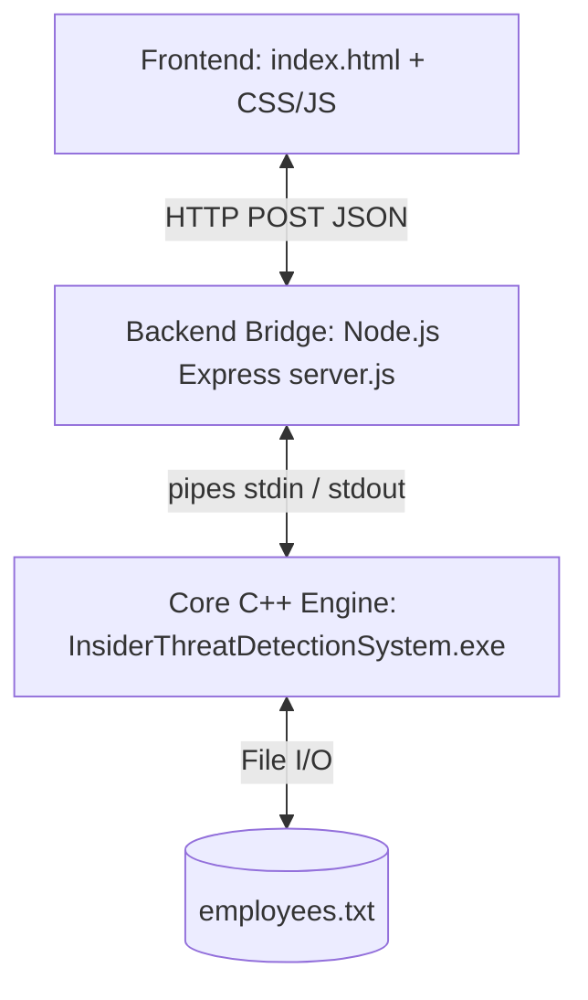
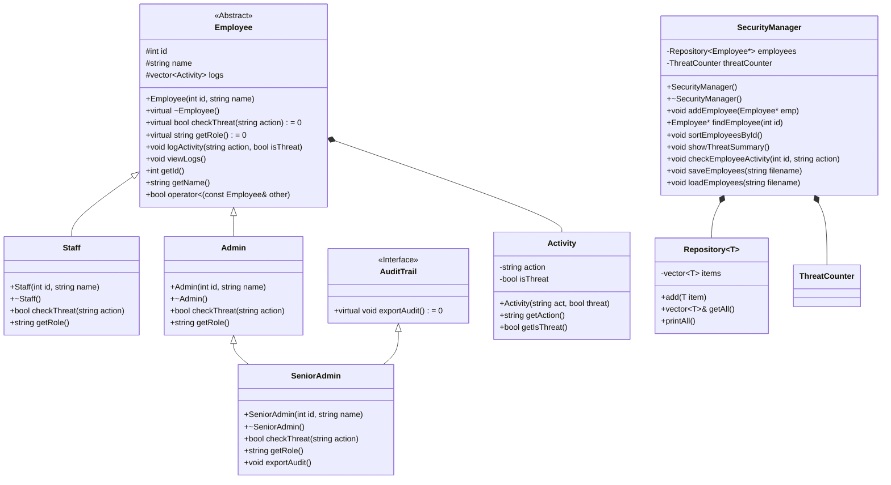

# Project Report: Insider Threat Detection System (ITDS)

## 1. System Design & Architecture
The Insider Threat Detection System (ITDS) is built using a modern **3-Tier Architecture** that integrates high-performance C++ execution with an interactive web-based interface.



*   **Frontend (Presentation Layer):** A dynamic dashboard (`index.html`) using clean HSL color palettes, dark mode, glassmorphic card designs, and micro-animations. It communicates asynchronously with the Node.js bridge.
*   **Backend Bridge (Application Layer):** A lightweight Node.js Express server (`server.js`) that manages persistent C++ child processes per user session. It translates web commands into `stdin` inputs and streams `stdout` results back as JSON. It includes an automatic 15-minute idle-process garbage-collector to optimize server resources.
*   **Core Engine (Data & Logic Layer):** A compiled C++ program implementing robust Object-Oriented programming models to manage employees, evaluate security risks, search/sort records, and write local data logs.

---

## 2. UML Class Diagram
The core engine design relies on polymorphic class hierarchies, multiple inheritance, templates, and STL containers.



---

## 3. Implementation of Object-Oriented Programming (OOP) Concepts

### A. Encapsulation
Attributes of our classes (e.g., `Employee::id`, `Employee::name`, `Activity::action`) are designated as `protected` or `private`. They cannot be accessed directly from external code and are only interactable via public getters and setters (e.g., `getId()`, `getName()`), preventing accidental corruption of internal state.

### B. Inheritance & Multiple Inheritance
*   **Single Inheritance:** `Staff` and `Admin` classes inherit directly from the `Employee` base class, reusing general identity properties and logging methods.
*   **Multiple Inheritance:** The `SeniorAdmin` class inherits from `Admin` (acquiring basic administrative credentials) while simultaneously inheriting from the `AuditTrail` abstract interface class. This models real-world requirements where senior administrators must implement specialized auditing traits.

### C. Polymorphism
*   **Runtime Polymorphism:** The base class declares `virtual bool checkThreat(string action) = 0;`. When the `SecurityManager` receives an activity, it calls `emp->checkThreat(action)` on a base pointer. C++ dynamically resolves this at runtime to execute `Staff::checkThreat` or `Admin::checkThreat`, checking if the employee has authorization for the given command.
*   **Polymorphic Destruction:** The base `Employee` class includes a `virtual ~Employee()` destructor. This ensures that when a derived object pointer is deleted, the derived class's destructor executes first, properly freeing custom attributes and avoiding memory leaks.

### D. Templates (Generics)
*   **Class Template:** `Repository<T>` acts as a generic storage class wrapping STL vectors, making it reusable for any data model.
*   **Function Template:** `isSameRole<T1, T2>(Employee* e1, Employee* e2)` compares the runtime classes of two employee pointers at compile time, asserting role parity using template metaprogramming.

### E. Run-Time Type Information (RTTI)
The `identifyType()` function uses `dynamic_cast` and `typeid` to safely query the exact subtype of an `Employee*` at runtime:
```cpp
if (dynamic_cast<SeniorAdmin*>(emp)) {
    cout << "Real Type: Senior Administrator\n";
}
```

---

## 4. Evidence of Input Validation & Resilience

We tested multiple critical input cases to verify backend and engine stability:

| Input Scenario | Target Component | Input Provided | Expected / Actual Result |
| :--- | :--- | :--- | :--- |
| **Invalid Option (Main Menu)** | `main.cpp` | `99` | Handled: Outputs `Invalid choice. Please try again.` |
| **Invalid Datatype (Int inputs)** | `main.cpp` | `abc` | **Passed:** `cin` fail state cleared via `cin.clear(); cin.ignore()`. Program prints error and returns to menu. |
| **Duplicate Employee Registration** | `SecurityManager.cpp` | Registering ID `101` twice | **Passed:** System detects duplicate ID, skips adding, and displays error message. |
| **Non-existent Employee Search** | `SecurityManager.cpp` | Querying logs of ID `999` | **Passed:** Safely prints `Employee not found.` without throwing null pointer exceptions. |

---

## 5. Demonstration of Program Outputs (Terminal Logs)

### Case A: Adding Employees and Triggering Threat Check
```
=== Insider Threat Detection System ===
1. Add Admin
2. Add Staff
3. Add Senior Admin
4. Perform Activity
5. View Employee Logs
6. Print All Employees
7. Identify Employee Type (RTTI)
8. Sort Employees by ID (STL)
9. View Threat Summary (STL Algorithms)
10. Export Senior Audit (Multiple Inheritance)
11. Compare Employee Roles (Templates)
12. Exit
Enter your choice: 2
Enter Staff ID: 201
Enter Staff Name: John Doe
Staff John Doe added successfully.

Enter your choice: 4
Enter Employee ID: 201
Enter Activity Action: Delete System Logs
[Staff Check] "Delete System Logs" -> FLAGGED AS THREAT (Unauthorized Access)
Activity logged.
```

### Case B: Running Automated Assertions (Unit Tests)
Executing `RunTests.exe` automatically checks core logic correctness:
```
Running Automated Tests...
testEmployeeCreationAndRoles passed.
  (SeniorAdmin destroyed: SeniorAdminTest)
  (Admin destroyed: SeniorAdminTest)
  (Employee base destroyed for: SeniorAdminTest)
  (Staff destroyed: StaffTest)
  (Employee base destroyed for: StaffTest)
  (Admin destroyed: AdminTest)
  (Employee base destroyed for: AdminTest)
[Admin Check] "Access Admin Files" -> Allowed (Full Access, No Restrictions)
[Staff Check] "Access Admin Files" -> FLAGGED AS THREAT (Unauthorized Access)
[Staff Check] "Normal Login" -> Allowed (Normal Activity)
testThreatDetection passed.
  (Staff destroyed: StaffTest)
  (Employee base destroyed for: StaffTest)
  (Admin destroyed: AdminTest)
  (Employee base destroyed for: AdminTest)
testSecurityManager passed.
  (Admin destroyed: TestAdmin)
  (Employee base destroyed for: TestAdmin)
All tests passed successfully.
```
